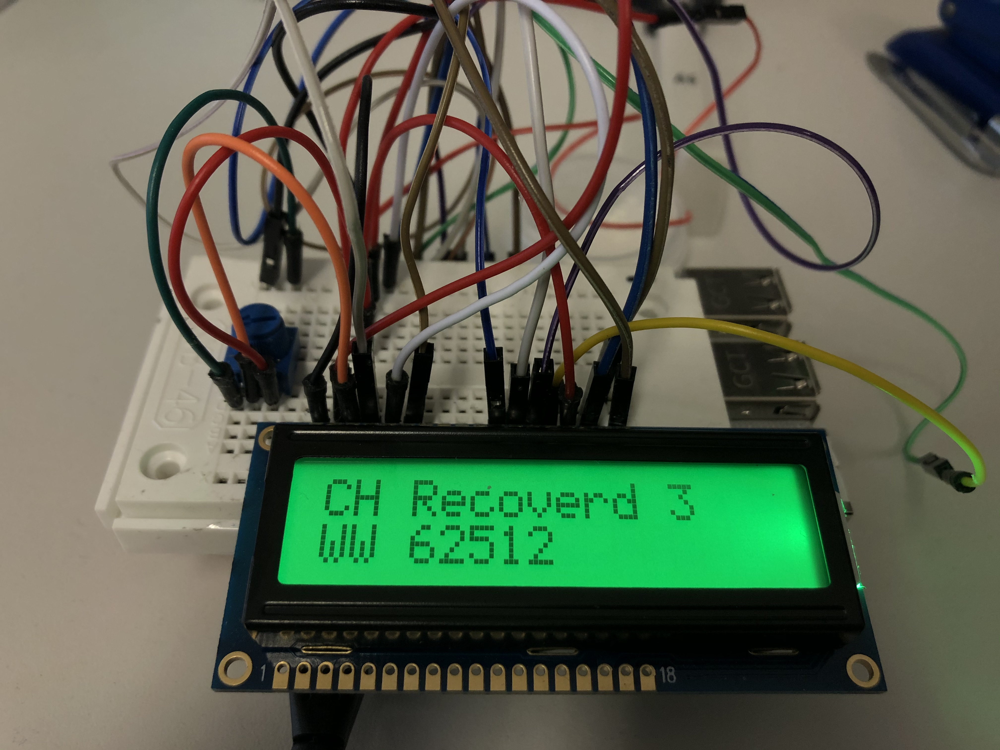
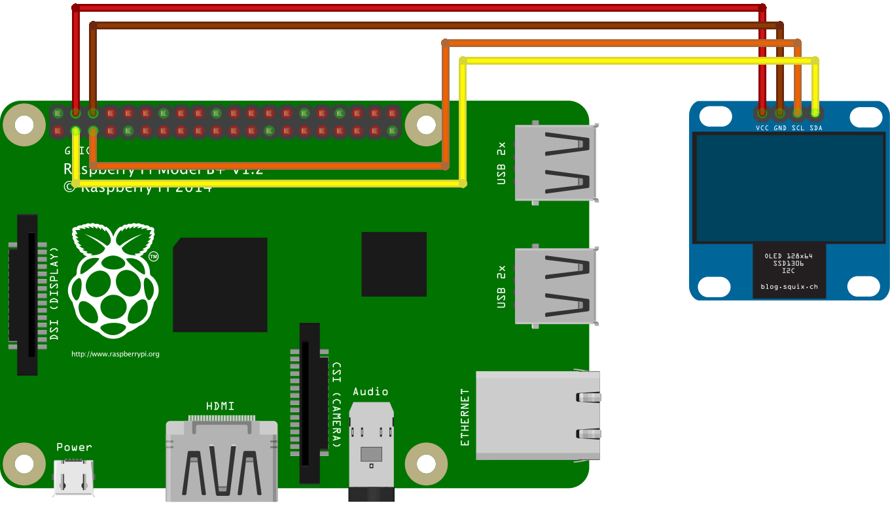

# Corona-display

To keep a eye on the current Corona-Virus numbers I created this Programm wich displays the current stats to the Display.



## Datasource

For data I use [this Website](https://corona.help/).

To extract the data I use BeautifulSoup.

## Make it work

To print the numbers to the Terminal simply run the `fetch.py` file.

To use it with an i2c Display you need to edit the `/module/config.py` file. 

Every line you ned to change is explained. 

## Wiring



## Setup

### Material 

You need the Folowing Material

- Any kind of a [Raspberry-Pi](https://thepihut.com/collections/raspberry-pi) with GPIO-Pins.
- I used this kind of LCD-Display [small](https://thepihut.com/products/i2c-16x2-arduino-lcd-display-module), [big](https://thepihut.com/products/i2c-20x4-arduino-lcd-display-module)
- Jumper Cables Female - Female [like This](https://thepihut.com/products/thepihuts-jumper-bumper-pack-120pcs-dupont-wire)


Moast of the things you allso can get on [AliExpress](https://aliexpress.com)

### Install

Fetch current version of GitHub.

```sh

cd ~
git clone https://github.com/julianbruegger/corona-display.git

cd ~/corona-display
```

To setup the Display run:

```sh

sudo chmod +x install.sh
sudo ./install.sh

```

This Installs all the dependencies.

To run the Programm run:

**Big Display**
```sh 
python3 display_20x4.py
```

**Small Display**
```sh
python3 display_16x2.py 
```


## Old Version

The first version of this with an other datasource is linked [V1](https://github.com/julianbruegger/corona-display/tree/V1)

Second version with Beautiful-Soup [V2](https://github.com/julianbruegger/corona-display/tree/V2)